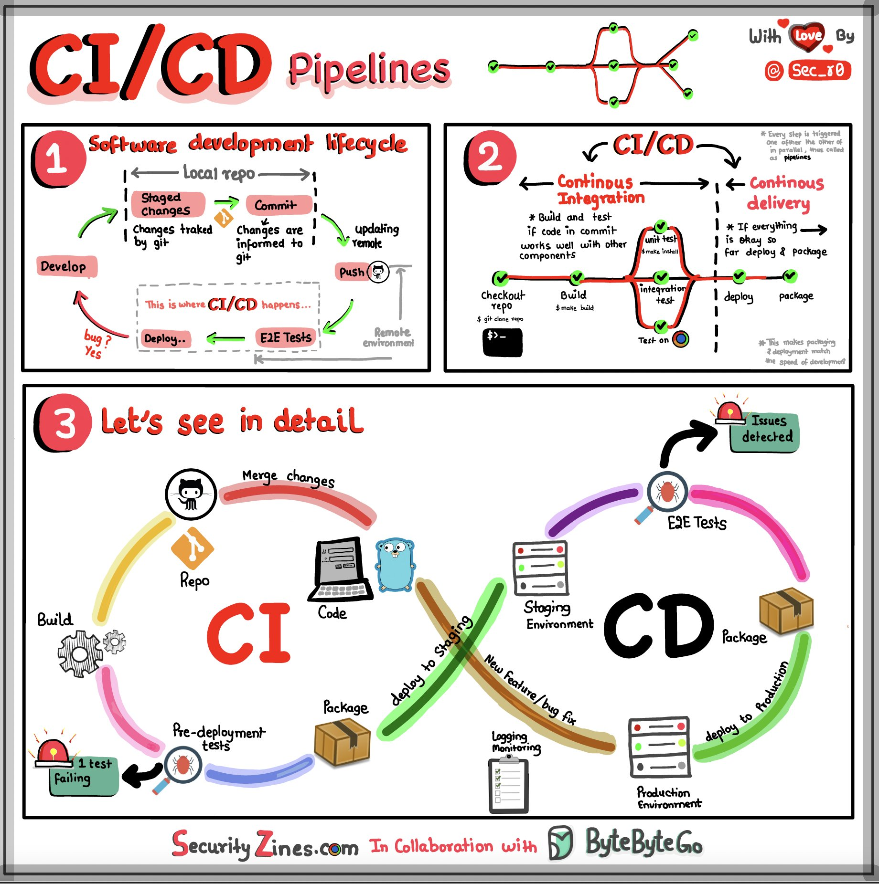
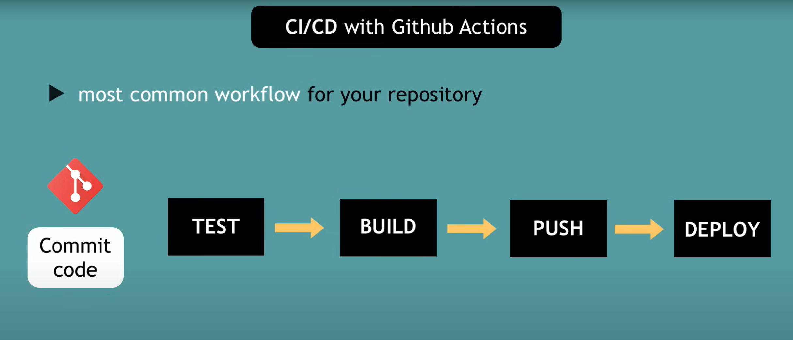
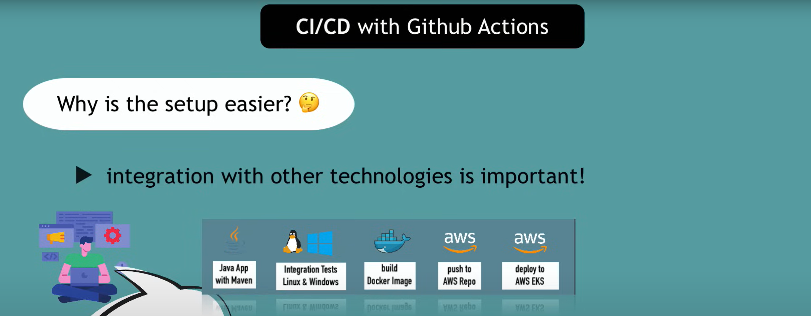

# CI/CD With GitHub Actions

##  GitHub Actions Documentation
    https://docs.github.com/actions

    

    

    

    

### REFERENCES
- https://docs.github.com/en/actions
- https://github.com/marketplace
- https://programmingpercy.tech/blog/github-actions-in-action/
- https://blog.bytebytego.com/p/ep71-cicd-pipeline-explained-in-simple