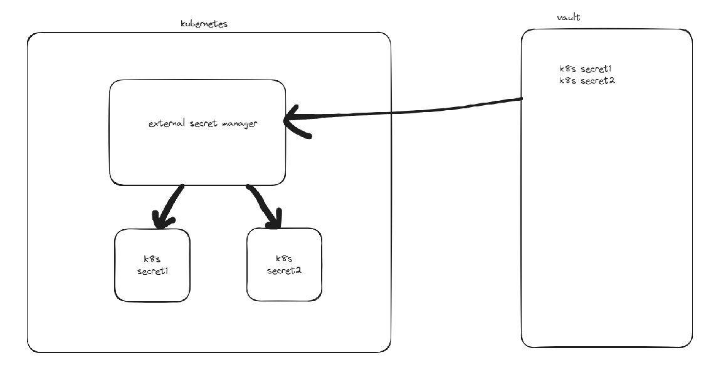

# CI/CD With GitHub Actions

##  GitHub Actions Documentation
    https://docs.github.com/actions

<p align="center">
    
</p>

<p align="center">
    
</p>

<p align="center">
    
</p>

<p align="center">
    
</p>


#### Note about checkout action: By default, Github actions does not check out our repository, so if we do not check out our repository, it cannot see all the files inside the repository. It will clone the repository without any complications like the manual cloning.

### REFERENCES
- https://docs.github.com/en/actions
- https://github.com/marketplace
- https://programmingpercy.tech/blog/github-actions-in-action/
- https://blog.bytebytego.com/p/ep71-cicd-pipeline-explained-in-simple


## ArgoCD

#### We will use ArgoCD for deployment because if you make a deployment, it is one of the most popular deployment tool.

#### In ArgoCD, there are 3 main concepts. Of course, there are many other concepts, but you should know at least these 3 main concepts.
#### These are the following:
#### 1) Repository: Argo needs to listen to a repository in order to make a deployment. In this case, this repository is my repository. I am mentioning it in repositories.yaml file.
####    Why Argo listens to our repository is because whenever we change something in this repository such as image tag, argo updates the deployment immediately. 
#### 2) Project: When we set up ArgoCD in our Kubernetes cluster, it comes with not only its controller but also its so many custom resource definitions. AppProject is only one of them.
#### In this file, we need to mention which repo Argo is listening and where it will make the deployment, in our case, it will make the deployment in our kubernetes cluster.
#### 3) Application: In application, we will mention the definitions of our microservices of course if we are developing a microservice project. If not, we will mention the definition of our monolith service.


Argonun bu noktada ki görevi şu, argo gidiyor bizim verdiğimiz o repository altındaki helm/myapp chartını hedefi olan asıl görevi olan kubernetes clusterı üzerine deploy etmeye çalışıyor.

#### Installation: 
- First, add argo's helm repo to our Kubernetes cluster;
  ```
  helm repo add argo https://argoproj.github.io/argo-helm  
  ```    
- Then, install them helm chart of argo into our Kubernetes cluster;
  ```
  helm install argocd argo/argo-cd -n argocd --create-namespace
  ```
- Then, do the port forward to reach argocd UI in port 8089 by using the k9s port forward option.
- Then, take the password by using the following on Windows;
  ```
  kubectl -n argocd get secret argocd-initial-admin-secret -o jsonpath="{.data.password}" |
  ForEach-Object { [System.Text.Encoding]::UTF8.GetString([System.Convert]::FromBase64String($_)) }
  ```
- Finally, apply the yaml files that present inside argocd/manifests.First, repositories.yaml, then projects.yaml, then applications.yaml
  ```
  kubectl apply -f ...
  ```

### REFERENCES
- https://argo-cd.readthedocs.io/en/stable/


## Secret & Configuration Management with Vault

#### Why do we need Vault ? Why don't we use kubernetes secret object?
#### Off course, we can use kubernetes secret object. However, in this case, we need to manually control our secrets. On the other hand, let's say we decided to use kubernetes secret object. But, how do we store secret values? In our computer or only you know them or from where you feed them?
#### Since we want a centralized location to manage our secrets without any fault , we will use Vault.


<p align="center">
    
</p>

``External secret manager :`` is an application that we'll set up with the help of helm inside our kubernetes cluster. It comes with several custom resource definitions just like in Kubernetes built-in resources such as Deployment, Pod, Secret etc.

The duty of External secret manager is to create our secrets in Kubernetes by using the provider that we are going to give to it. In our case, the provider will be Vault, meaning we are going to manage our secrets in Vault.
Then, we can give these created secrets to our deployments.
#### What is the goal of External Secrets Operator?
The goal of External Secrets Operator is to synchronize secrets from external APIs into Kubernetes. ESO is a collection of custom API resources - ExternalSecret, SecretStore and ClusterSecretStore.

- #### ClusterSecretStore: We mention which secret management tool we are using. Is it Vault or AWS Secret Manage or GCP Secret Manager? This is the component that constructs a bridge to Vault.
  ```
  apiVersion: external-secrets.io/v1beta1
  kind: ClusterSecretStore
  metadata:
    name: vault-backend
  spec:
    provider:
      vault:
        server: "http://vault.vault.svc.cluster.local:8200"
        path: "secret"
        version: "v1"
        auth:
          tokenSecretRef:
            name: "vault-token"
            key: "token"

  ```

- #### ExternalSecret: 

    ```
    apiVersion: external-secrets.io/v1beta1
    kind: ExternalSecret
    metadata:
    name: demo
    spec:
      refreshInterval: "15s"
      secretStoreRef:
        name: vault-backend           # This is the name of the ClusterSecretStore that we have created.
        kind: ClusterSecretStore
      target:
        name: database                # Adı database olan bir tane secret yaratacak.
        creationPolicy: Owner
      data:
        - secretKey: password
        remoteRef:
          key: secret/database
          property: password

    ```

#### Installation:
- First, install vault by using helm
  ```
  helm install vault hashicorp/vault -n vault --create-namespace
  ```  
- Then, do the port forwarding to reach vault UI in port 8200
- Then, create your own secret 
- Then, install external secret manager by using helm
  ```
  helm install external-secrets external-secrets/external-secrets -n external-secrets --create-namespace --set installCRDs=true
  ```
- Then, apply yaml files. First, cluster-secret-store.yaml, then external-secret.yaml
  ```
  kubectl apply -f ...
  ```


### REFERENCES
- https://developer.hashicorp.com/vault/docs
- https://external-secrets.io/latest/