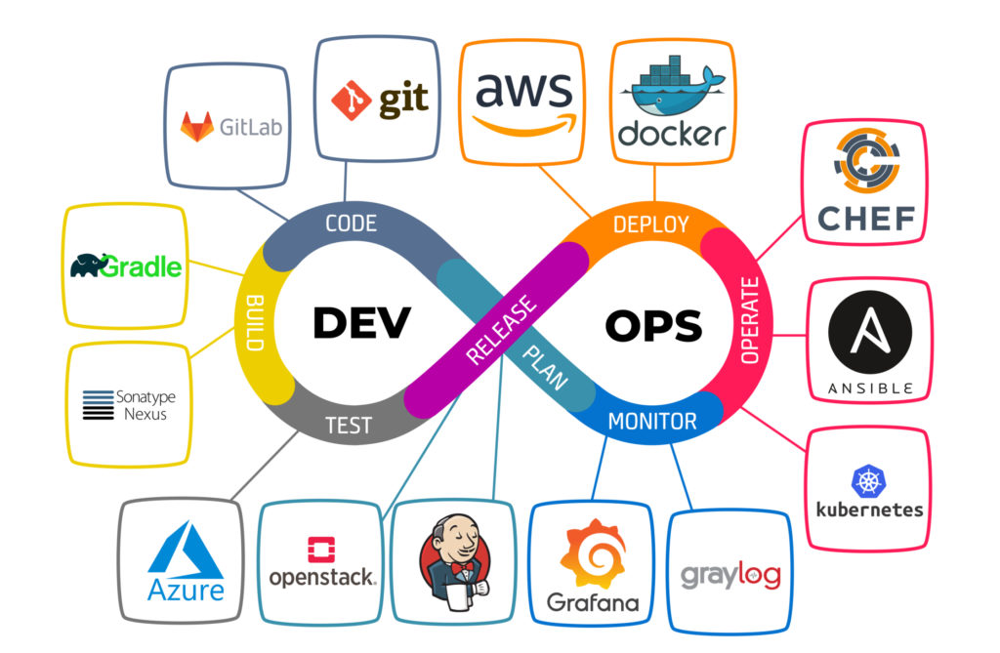

# CI/CD With GitHub Actions

##  GitHub Actions Documentation
    https://docs.github.com/actions

    

    

    

    

#### Note about checkout action: By default, Github actions does not check out our repository, so if we do not check out our repository, it cannot see all the files inside the repository. It will clone the repository without any complications like the manual cloning.

### REFERENCES
- https://docs.github.com/en/actions
- https://github.com/marketplace
- https://programmingpercy.tech/blog/github-actions-in-action/
- https://blog.bytebytego.com/p/ep71-cicd-pipeline-explained-in-simple

## ArgoCD

#### We will use ArgoCD for deployment because if you make a deployment, it is one of the most popular deployment tool.
#### In ArgoCD, there are 3 main concepts. Of course, there are many other concepts, but you should know at least these 3 main concepts.
#### These are the following:
#### 1) Repository: Argo needs to listen to a repository in order to make a deployment. In this case, this repository is my repository. I am mentioning it in repositories.yaml file.
####    Why Argo listens to our repository is because whenever we change something in this repository such as image tag, argo updates the deployment immediately. 
#### 2) Project: When we set up ArgoCD in our Kubernetes cluster, it comes with not only its controller but also its so many custom resource definitions. AppProject is only one of them.
#### In this file, we need to mention which repo Argo is listening and where it will make the deployment, in our case, it will make the deployment in our kubernetes cluster.
#### 3) Application: In application, we will mention the definitions of our microservices of course if we are developing a microservice project. If not, we will mention the definition of our monolith service.